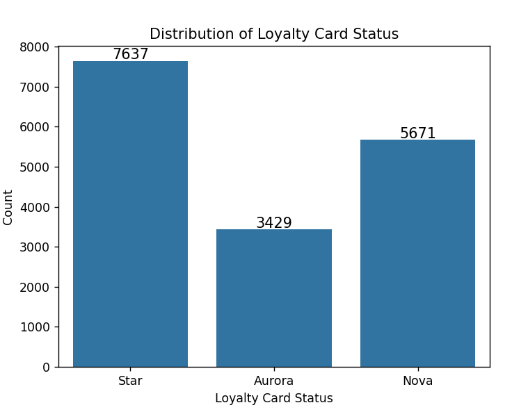
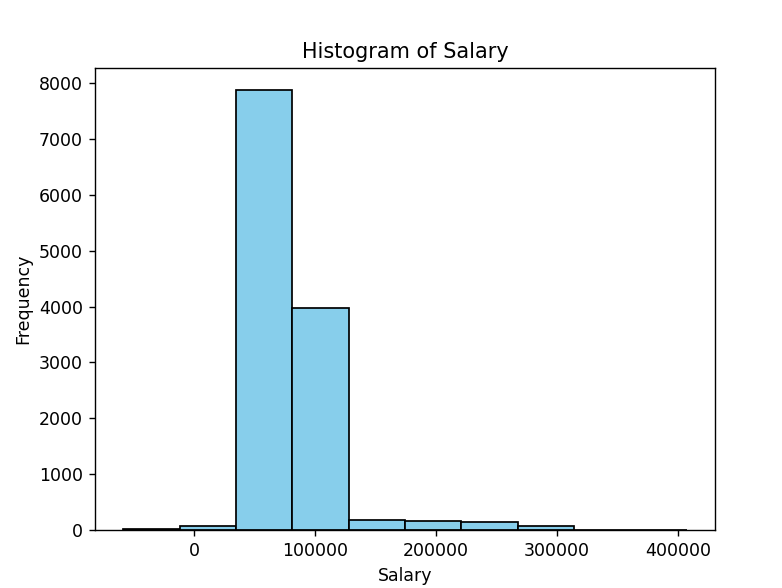
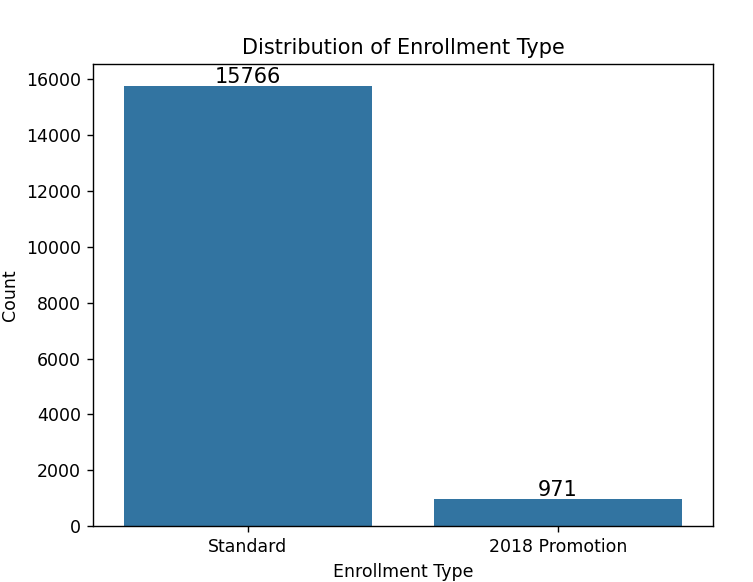
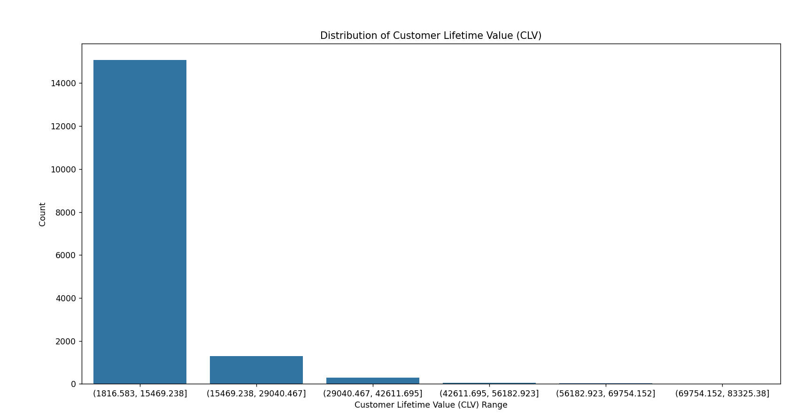

# Causal Inference Project

## Project Description

**Causal Inference Question**:

Does having a loyalty card (Star, Nova, Aurora) cause an increase in
CLV?

**Context**:

I want to study if loyalty card status for an airline causes an increase
in CLV. CLV is Customer Lifetime Value. It is computed as the sum of all
revenues (or invoices) generated by the customer for their flight
bookings over their entire membership period. Basically, it’s how much
total revenue a specific customer is expected to generate. The Star
loyalty card is the highest, Nova is the next highest, and Aurora is
third highest. In the data, only these 3 loyalties are listed.

The outcome would be positive and continuous values because it’s how
much revenue is expected to be made under the CLV. Other predictor
variables that could influence CLV is salary, education level, marital
status, total flights, and enrollment year/month. Other variables that
could influence our outcome could be country of residence, gender,
distance traveled, points redeemed, and dollar cost of points redeemed.

I believe that if you have a loyalty card, you’ll earn more revenue for
the airline.

https://www.kaggle.com/datasets/agungpambudi/airline-loyalty-campaign-program-impact-on-flights/data

This is my Causal Inference DAG:

Based on the DAG, there are “backdoor” paths that will influence
causality. In order to control for these and determine causality, we
must make an adjustment set.

Our adjustment set, or variables we need to include in our model, is
Income, Travel Frequency, Customer Marketing Strategy, and Customer
Engagement.

## Model Variables

### Loyalty Card Status

This is whether or not you have an airline loyalty card, whether that’s
Star, Nova, or Aurora. Here is a break down of the data by type of
loyalty card. We can see that most people have the highest loyalty card,
Star, followed by Nova and then by Aurora.

### Income

Most people have an income between roughly \$80,000 and \$125,000. This
is expected. There are of course some who have higher salaries, hence
the right skew.

### Travel Frequency

This variable is how frequently a person travels. I do not have this
variable in my dataset.

### Customer Marketing Strategy

This variable is how well the airline markets their products. I don’t
have a direct variable for this in my dataset but I do know which
enrollment types people did when they got a loyalty card.

### Customer Engagement

This variable is how engaged a person is in the airline. I do not have
this variable in my dataset.

### CLV

This variable is Customer Lifetime Value, or how much revenue a single
person generates the airline company. It seems that most people earn the
airline between roughly \$2,000 and \$15,000.

