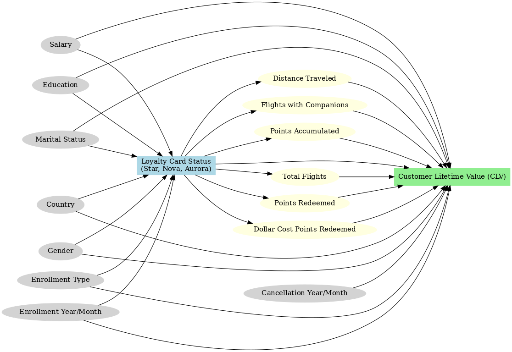
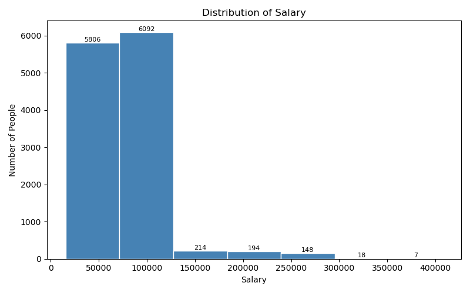
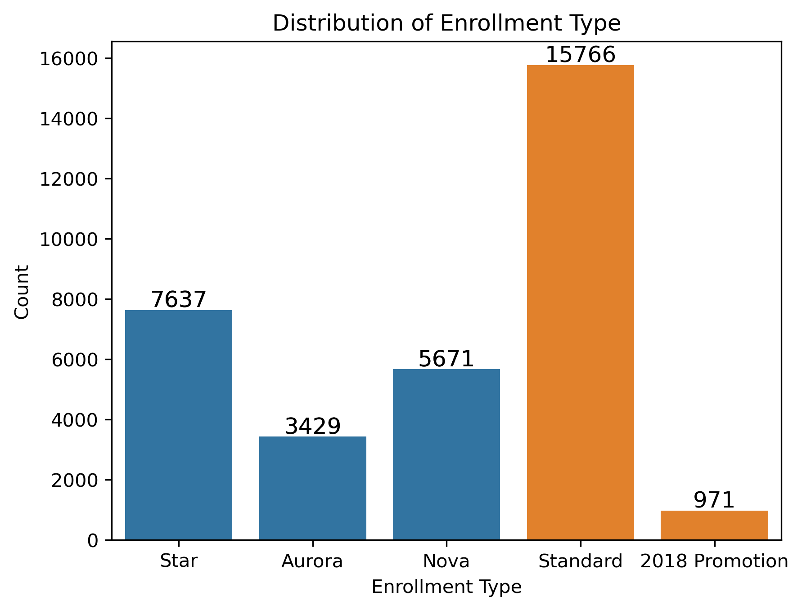
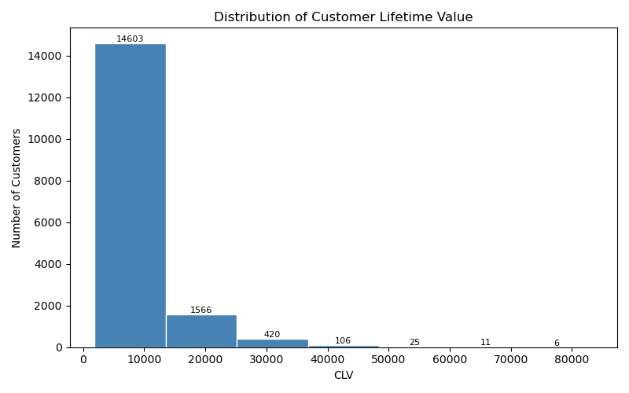
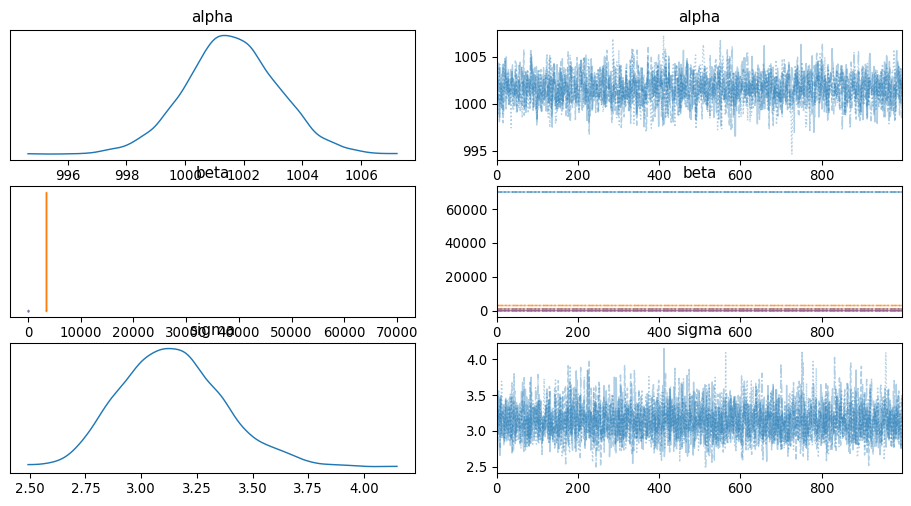
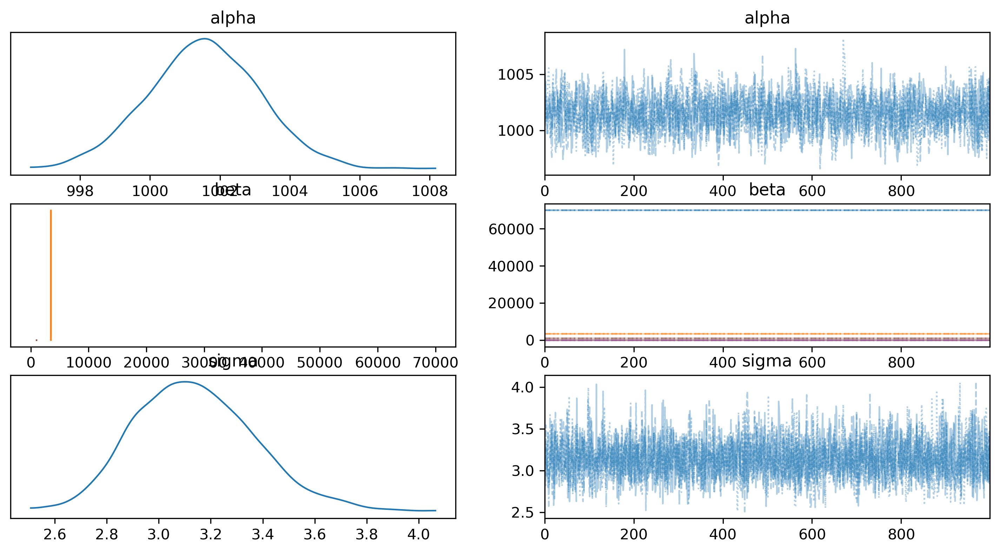
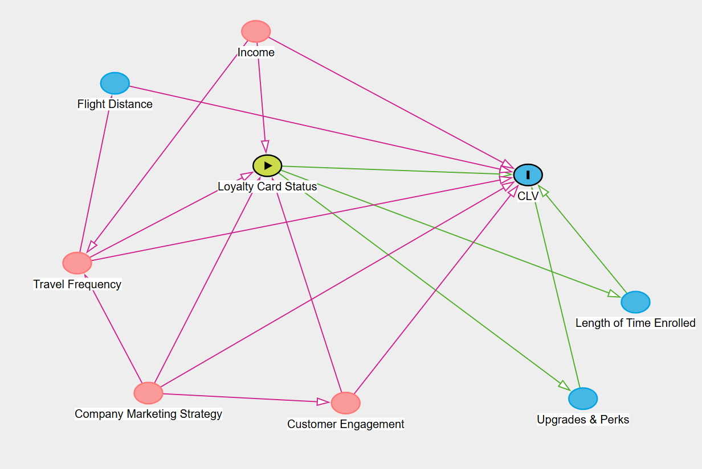

# Airline Loyalty Causal Inference


## Milestone 1: Project Idea

I’m really passionate about anything related to airlines, so for this
project, I want to take a causal approach to analyzing airline data.
Specifically, I’m interested in whether loyalty card programs actually
increase an airline’s revenue, measured by Customer Lifetime Value
(CLV).

## Milestone 2: Data Story

Causal Inference Question: Does having a higher loyalty card status
(Star, Nova, Aurora) cause an increase in CLV?

Context: I want to study if having a higher loyalty card status for an
airline causes an increase in CLV. CLV is Customer Lifetime Value. It is
computed as the sum of all revenues (or invoices) generated by the
customer for their flight bookings over their entire membership period.
Basically, it’s how much total revenue a specific customer is expected
to generate. The Star loyalty card is the highest, Nova is the next
highest, and Aurora is third highest. In the data, only these 3
loyalties are listed.

The outcome would be positive and continuous values because it’s how
much revenue is expected to be made under the CLV. Other predictor
variables that could influence CLV is salary, education level, marital
status, total flights, and enrollment year/month. Other variables that
could influence our outcome could be country of residence, gender,
distance traveled, points redeemed, and dollar cost of points redeemed.

My story is that I believe that having a loyalty card increases the
revenue you will make for the airline.

https://www.kaggle.com/datasets/agungpambudi/airline-loyalty-campaign-program-impact-on-flights/data

## Milestone 3: DAG

For the first DAG I created, I chose to use the variables from my
dataset. I believed that demographics each influenced both CLV and
loyalty card status. I also believed that loyalty card status affected
flights and points which in turn affected CLV.


This is the second DAG I created when I considered even more variables
than my previous DAG. I added more demographics, flight aspects, and
points/economic aspects.



## Milestone 4: Identification Strategy

Based on the DAG, here are all possible paths (23 paths) from LCS
(Loyalty Card Status) to CLV (Customer Lifetime Value):

- LCS, CLV
- LCS, I, CLV
- LCS, I, TF, CLV
- LCS, I, TF, FD, CLV
- LCS, I, TF, CMS, CLV
- LCS, I, TF, CMS, CE, CLV
- LCS, TF, CLV
- LCS, TF, I, CLV
- LCS, TF, FD, CLV
- LSC, TF, CMS, CLV
- LCS, TF, CMS, CE, CLV
- LCS, CMS, CLV
- LCS, CMS, CE, CLV
- LCS, CMS, TF, CLV
- LCS, CMS, TF, FD, CLV
- LCS, CMS, TF, I, CLV
- LCS, CE, CLV
- LCS, CE, CMS, CLV
- LCS, CE, CMS, TF, CLV
- LCS, CE, CMS, TF, FD, CLV
- LCS, CE, CMS, TF, I, CLV
- LCS, UP, CLV
- LCS, LTE, CLV

Direct pipes, Can estimate total causal effect through them

- LCS, UP, CLV
- LCS, LTE, CLV

Here are the backdoors & what to do about them:

- LCS, I, CLV – Fork, Condition on I
- LCS, I, TF, CLV – Fork, Pipe, Condition on TF
- LCS, I, TF, FD, CLV – Fork, Pipe, Pipe, Condition on FD (?)
- LCS, I, TF, CMS, CLV –Fork, Collider, Fork, Condition on CMS
- LCS, I, TF, CMS, CE, CLV – Fork, Collider, Fork, Pipe, Condition on CE
  (??)
- LCS, TF, CLV – Fork, Condition on TF
- LCS, TF, I, CLV – Fork, Pipe, Condition on I
- LCS, TF, FD, CLV – Fork, Pipe, Condition on FD (?)
- LSC, TF, CMS, CLV – Pipe, Fork, Condition on CMS
- LCS, TF, CMS, CE, CLV – Pipe, Fork, Pipe, Condition on CE
- LCS, CMS, CLV – Fork, Condition on CMS
- LCS, CMS, CE, CLV – Fork, Pipe, Condition on CE (?)
- LCS, CMS, TF, CLV – Fork, Pipe, Condition on CMS (?)
- LCS, CMS, TF, FD, CLV – Fork, Pipe, Pipe, Condition on CMS & TF (??)
- LCS, CMS, TF, I, CLV – Fork, Collider, Fork, Condition on CMS, TF, & I
  (all are needed in the end I believe) (?)
- LCS, CE, CLV – Fork, Condition on CE
- LCS, CE, CMS, CLV – Pipe, Fork, Condition on CE or CMS
- LCS, CE, CMS, TF, CLV – Pipe, Fork, Pipe, Condition on CE or CMS or TF
  (all are needed in the end I believe) (?)
- LCS, CE, CMS, TF, FD, CLV – Pipe, Fork, Pipe, Pipe, Condition on CE or
  CMS or TF (all are needed in the end I believe) (?)
- LCS, CE, CMS, TF, I, CLV – Pipe, Fork, Collider, Fork, Condition on CE
  or CMS or TF or I (all are needed in the end I believe) (?)

Adjustment Set: I, TF, CMS, and CE.

## Milestone 5: Simulate Data and Recover Parameters

``` python
import numpy as np
import polars as pl
import seaborn as sns
from sklearn.linear_model import LinearRegression

np.random.seed(42)

# Set the parameter values.
beta0 = 1000
income = 70000
flight_dist = 3500
travel_freq = 5
cust_marketing_strat = 1
cust_engagement = 3
loyalty_card_status = 1000
n = 100

sim_data = (
    # Simulate predictors using appropriate np.random distributions.
    pl.DataFrame({
        'x': np.random.uniform(0, 7, size=n),
        'flight_dist': np.random.uniform(0, 10000, size=n),
        'travel_freq': np.random.uniform(1, 10, size=n),
        'cust_marketing_strat': np.random.uniform(0, 5, size=n),
        'cust_engagement': np.random.uniform(1, 10, size=n),
        'loyalty_card_status': np.random.choice([0, 1], size=n)  # New binary predictor
    })
    # Use predictors and parameter values to simulate the outcome.
    .with_columns([ 
        (
            beta0 + income * pl.col('x') + flight_dist * pl.col('flight_dist') +
            travel_freq * pl.col('travel_freq') +
            cust_marketing_strat * pl.col('cust_marketing_strat') +
            cust_engagement * pl.col('cust_engagement') +
            loyalty_card_status * pl.col('loyalty_card_status') +  # Adding loyalty_card_status with a coefficient (e.g., 1000)
            np.random.normal(0, 3, size=n)
        ).alias('CLV')  # Renaming y to CLV
    ])
)

# Display the data
sim_data

# Visualize the data
# sns.scatterplot(data=sim_data, x='x', y='CLV')
# sns.lmplot(data=sim_data, x='x', y='CLV', height=6, aspect=1, scatter_kws={'s': 10}, line_kws={'color': 'red'})

# Specify the X matrix and CLV vector.
X = sim_data[['x', 'flight_dist', 'travel_freq', 'cust_marketing_strat', 'cust_engagement', 'loyalty_card_status']]
CLV = sim_data['CLV']

# Create a linear regression model.
model = LinearRegression(fit_intercept=True)
# Train the model.
model.fit(X, CLV)

# Print the coefficients
print(f'Intercept: {model.intercept_}')
print(f'Slope for x: {model.coef_[0]}')
print(f'Slope for flight_dist: {model.coef_[1]}')
print(f'Slope for travel_freq: {model.coef_[2]}')
print(f'Slope for cust_marketing_strat: {model.coef_[3]}')
print(f'Slope for cust_engagement: {model.coef_[4]}')
print(f'Slope for loyalty_card_status: {model.coef_[5]}')

# Have you recovered the parameters?
# Yes

# Intercept: 1001.5413256846368
# Slope for x: 69999.86275851386
# Slope for flight_dist: 3499.9999835407984
# Slope for travel_freq: 5.112035246336143
# Slope for cust_marketing_strat: 0.8774017286699657
# Slope for cust_engagement: 2.7190101859602787
# Slope for loyalty_card_status: 1000.1457705767122
```

In this code, a simulated dataset is created using various predictors
(independent variables) to estimate the Customer Lifetime Value (CLV),
which is the outcome (dependent variable). The code first defines the
parameter values for each predictor, including factors like income,
flight distance, travel frequency, customer marketing strategy, customer
engagement, and loyalty card status. It then generates random values for
these predictors and combines them in a linear equation to simulate CLV.
This equation also includes a small amount of random noise to make the
data more realistic.

After generating the data, a linear regression model is applied to it
using the `LinearRegression` function from the `sklearn` library. The
model is trained using the predictors (`X`) and the simulated CLV
values. Once the model is trained, the code prints the estimated
coefficients for each predictor, which represent how each variable
impacts the CLV. By examining these coefficients, we can understand the
relationship between the predictors and CLV.

## Milestone 6: Exploratory Data Analysis

Loyalty Card Status is whether or not you have an airline loyalty card,
whether that’s Star, Nova, or Aurora. Here is a break down of the data
by type of loyalty card. We can see that most people have the highest
loyalty card, Star, followed by Nova and then by Aurora.

``` python
# Create a bar plot for loyalty_card_status
ax = sns.countplot(x='Loyalty Card', data=data)

# Set labels and title
plt.xlabel('Loyalty Card Status')
plt.ylabel('Count')
plt.title('Distribution of Loyalty Card Status')

# Add the count labels on top of the bars without decimals
for p in ax.patches:
    ax.annotate(f'{int(p.get_height())}', 
                (p.get_x() + p.get_width() / 2., p.get_height()), 
                ha='center', va='center', 
                fontsize=12, color='black', 
                xytext=(0, 5), textcoords='offset points')

# Save the figure
plt.savefig('loyalty_card_distribution_bar_chart.png', dpi=300, bbox_inches='tight')
```


Most people have an income between roughly \$80,000 and \$125,000. This
is expected. There are of course some who have higher salaries, hence
the right skew.

``` python
# Clean the data by removing null, empty, and negative salary values
data_clean = data[data['Salary'].notnull() & (data['Salary'] != '')]
data_clean = data_clean[data_clean['Salary'] >= 0]

# Plot the histogram
plt.hist(data_clean['Salary'], bins=8, color='skyblue', edgecolor='black')
plt.title('Histogram of Salary')
plt.xlabel('Salary')
plt.ylabel('Frequency')

# Save the figure
plt.savefig('../figures/salary_histogram.png', dpi=300, bbox_inches='tight')
```



Travel Frequency is how frequently a person travels. I do not have this
variable in my dataset.

Customer Marketing Strategy is how well the airline markets their
products. I don’t have a direct variable for this in my dataset but I do
know which enrollment types people did when they got a loyalty card.

``` python
# Create a bar plot for Enrollment Type
ax = sns.countplot(x='Enrollment Type', data=data)

# Set labels and title
plt.xlabel('Enrollment Type')
plt.ylabel('Count')
plt.title('Distribution of Enrollment Type')

# Add the count labels on top of the bars without decimals
for p in ax.patches:
    ax.annotate(f'{int(p.get_height())}', 
                (p.get_x() + p.get_width() / 2., p.get_height()), 
                ha='center', va='center', 
                fontsize=12, color='black', 
                xytext=(0, 5), textcoords='offset points')

# Save the figure
plt.savefig('../figures/enrollment_type_bar_chart.png', dpi=300, bbox_inches='tight')
```



Customer Engagement is how engaged a person is in the airline. I do not
have this variable in my dataset.

CLV is Customer Lifetime Value, or how much revenue a single person
generates the airline company. It seems that most people earn the
airline between roughly \$2,000 and \$15,000.

``` python
# Clean the data and remove negative values
data_clean = data[data['CLV'].notnull() & (data['CLV'] != '')]
data_clean = data_clean[data_clean['CLV'] >= 0]  

# Plot the histogram
plt.hist(data_clean['CLV'], bins=6, edgecolor='black')

# Add titles and labels
plt.title('Distribution of Customer Lifetime Value (CLV)')
plt.xlabel('Customer Lifetime Value (CLV)')
plt.ylabel('Count')

# Save the figure
plt.savefig('../figures/clv_histogram.png', dpi=300, bbox_inches='tight')
```



## Milestone 7: Estimate Causal Effects

``` python
# eval: false
import numpy as np
import polars as pl
import pymc as pm
import arviz as az
import seaborn as sns
import matplotlib.pyplot as plt

np.random.seed(42)

# Set the parameter values.
beta0 = 1000
income = 70000
flight_dist = 3500
travel_freq = 5
cust_marketing_strat = 1
cust_engagement = 3
loyalty_card_status = 1000
n = 100

# Simulate Data
sim_data = (
    pl.DataFrame({
        'x': np.random.uniform(0, 7, size=n),
        'flight_dist': np.random.uniform(0, 10000, size=n),
        'travel_freq': np.random.uniform(1, 10, size=n),
        'cust_marketing_strat': np.random.uniform(0, 5, size=n),
        'cust_engagement': np.random.uniform(1, 10, size=n),
        'loyalty_card_status': np.random.choice([0, 1], size=n)
    })
    .with_columns([ 
        (
            beta0 + income * pl.col('x') + flight_dist * pl.col('flight_dist') +
            travel_freq * pl.col('travel_freq') +
            cust_marketing_strat * pl.col('cust_marketing_strat') +
            cust_engagement * pl.col('cust_engagement') +
            loyalty_card_status * pl.col('loyalty_card_status') +
            np.random.normal(0, 3, size=n)
        ).alias('CLV')
    ])
)

# Separate predictors and outcome
X = sim_data[['x', 'flight_dist', 'travel_freq', 'cust_marketing_strat', 'cust_engagement', 'loyalty_card_status']].to_numpy()
CLV = sim_data['CLV'].to_numpy()

# Bayesian Linear Regression Model
with pm.Model() as clv_model:
    # Priors
    alpha = pm.Normal('alpha', mu=0, sigma=1000)
    beta = pm.Normal('beta', mu=0, sigma=50000, shape=X.shape[1])  # One coefficient per feature
    sigma = pm.HalfNormal('sigma', sigma=100)

    # Likelihood
    mu = alpha + X @ beta  # Matrix multiplication of predictors and coefficients
    y_obs = pm.Normal('y_obs', mu=mu, sigma=sigma, observed=CLV)

    # Posterior Sampling
    trace = pm.sample(1000, return_inferencedata=True)

# Summary of results
summary = az.summary(trace, round_to=2)
print(summary)

# Visualizing the marginal posteriors
az.plot_trace(trace, combined=True)


# Save the figure as a file
plt.savefig("../figures/trace_plot.png", dpi=300, bbox_inches="tight")
```

    Initializing NUTS using jitter+adapt_diag...
    Multiprocess sampling (4 chains in 4 jobs)
    NUTS: [alpha, beta, sigma]

<pre style="white-space:pre;overflow-x:auto;line-height:normal;font-family:Menlo,'DejaVu Sans Mono',consolas,'Courier New',monospace">C:\Users\rhigb\anaconda3\envs\pymc_env\lib\site-packages\rich\live.py:231: UserWarning: install "ipywidgets" for 
Jupyter support
  warnings.warn('install "ipywidgets" for Jupyter support')
</pre>

<pre style="white-space:pre;overflow-x:auto;line-height:normal;font-family:Menlo,'DejaVu Sans Mono',consolas,'Courier New',monospace"></pre>

    Sampling 4 chains for 1_000 tune and 1_000 draw iterations (4_000 + 4_000 draws total) took 63 seconds.

                 mean    sd    hdi_3%   hdi_97%  mcse_mean  mcse_sd  ess_bulk  \
    alpha     1001.54  1.58    998.55   1004.50       0.03     0.02   2073.61   
    beta[0]  69999.86  0.16  69999.55  70000.16       0.00     0.00   3172.77   
    beta[1]   3500.00  0.00   3500.00   3500.00       0.00     0.00   3162.71   
    beta[2]      5.11  0.13      4.88      5.36       0.00     0.00   2750.57   
    beta[3]      0.87  0.24      0.45      1.34       0.00     0.00   3211.19   
    beta[4]      2.71  0.11      2.50      2.92       0.00     0.00   3788.70   
    beta[5]   1000.15  0.65    998.97   1001.39       0.01     0.01   2609.00   
    sigma        3.15  0.24      2.72      3.60       0.00     0.00   2977.16   

             ess_tail  r_hat  
    alpha     2407.12    1.0  
    beta[0]   2532.05    1.0  
    beta[1]   2736.14    1.0  
    beta[2]   2775.74    1.0  
    beta[3]   2669.58    1.0  
    beta[4]   2956.56    1.0  
    beta[5]   2576.18    1.0  
    sigma     2596.37    1.0  





## Milestone 8: Intermediate Presentation

See my intermediate presentation [Intermediate Presentation
Slides](https://github.com/RebeccaHull/causal_inference/blob/main/presentations/Intermediate_CI_Presentation_Hull.html).
To summarize some feedback:

- I need to make sure my salary histogram does not have a bin nor data
  that goes below 0.
- I need to make sure that my CLV histogram has touching bars.
  Additionally, set the number of bins to something that makes sense for
  the data (so in my case, more bins).

## Milestone 9: Run Conjoint Experiment

I ran a conjoint experiment through a survey using Discover Sawtooth
Software. I was testing how desirable different package deals (with
specified benefits) were for different loyalty cards. I got 33
responses. Here are my results:


## Milestone 10: Implement Diff-in-Diff Strategy

``` python
import arviz as az
import numpy as np
import pandas as pd
import pymc as pm
import seaborn as sns

# Outcomes

def outcome(t, control_intercept, treat_intercept_delta, trend, Δ, group, treated):
    return control_intercept + (treat_intercept_delta * group) + (trend * t) + (Δ * treated * group)

def is_treated(t, intervention_time, group):
    return (t > intervention_time) * group

# True parameters
control_intercept = 5000  # CLV for non-members
baseline_treat_intercept = 6000  # CLV for Aurora before upgrade
trend = 3000  # General CLV increase over time
Δ = 2000  # Treatment effect: additional CLV boost from upgrading to Star
intervention_time = 0.5  # When the upgrade happens

# Generating Synthetic Dataset
df = pd.DataFrame(
    {
        "group": [0, 0, 1, 1] * 10,  # 0 = No Loyalty Card, 1 = Aurora
        "t": [0.0, 1.0, 0.0, 1.0] * 10,  # Time periods (Pre/Post)
        "unit": np.concatenate([[i] * 2 for i in range(20)]),
    }
)

df["treated"] = is_treated(df["t"], intervention_time, df["group"])

df["y"] = outcome(
    df["t"],
    control_intercept,
    baseline_treat_intercept - control_intercept,  # Initial difference in CLV
    trend,
    Δ,
    df["group"],
    df["treated"],
)
df["y"] += np.random.normal(0, 500, df.shape[0])  # Add noise

# Frequentist Diff-in-Diff Calculation
diff_control = (
    df.loc[(df["t"] == 1) & (df["group"] == 0)]["y"].mean()
    - df.loc[(df["t"] == 0) & (df["group"] == 0)]["y"].mean()
)
print(f"Pre/post difference in control group = {diff_control:.2f}")

diff_treat = (
    df.loc[(df["t"] == 1) & (df["group"] == 1)]["y"].mean()
    - df.loc[(df["t"] == 0) & (df["group"] == 1)]["y"].mean()
)

print(f"Pre/post difference in treatment group = {diff_treat:.2f}")

diff_in_diff = diff_treat - diff_control
print(f"Difference in differences = {diff_in_diff:.2f}")

# Bayesian Approach
with pm.Model() as model:
    # Data
    t = pm.MutableData("t", df["t"].values, dims="obs_idx")
    treated = pm.MutableData("treated", df["treated"].values, dims="obs_idx")
    group = pm.MutableData("group", df["group"].values, dims="obs_idx")
    # Priors
    _control_intercept = pm.Normal("control_intercept", 5000, 1000)
    _treat_intercept_delta = pm.Normal("treat_intercept_delta", 1000, 1000)
    _trend = pm.Normal("trend", 3000, 1000)
    _Δ = pm.Normal("Δ", 2000, 1000)
    sigma = pm.HalfNormal("sigma", 500)
    # Expectation
    mu = pm.Deterministic(
        "mu",
        outcome(t, _control_intercept, _treat_intercept_delta, _trend, _Δ, group, treated),
        dims="obs_idx",
    )
    # Likelihood
    pm.Normal("obs", mu, sigma, observed=df["y"].values, dims="obs_idx")

with model:
    idata = pm.sample()

az.plot_trace(idata, var_names="~mu");


# Results
# Pre/post difference in control group = 3006.32
# Pre/post difference in treatment group = 4935.59
# Difference in differences = 1929.27
```

Those who upgraded to a higher loyalty status (aka got the treatment)
had an increase of \$1929.27 in CLV after they upgraded from an Aurora
card to a higher status loyalty card.

## Milestone 11: Clean Up Project Report

I created and cleaned up my project report in the writing folder.

A few changes I made:

- The CLV histogram now have bins that touch and a more appropriate
  number of bins.

- The Salary histogram no longer has a bin below zero (since you can’t
  have a negative salary).

I updated my DAG throughout the project and finalized it using Dagitty
to give it a more polished and professional appearance. In the DAG, the
primary relationship I’m interested in is the effect of **loyalty card
status** on **Customer Lifetime Value (CLV)**.

Several other variables influence this relationship. **Travel
frequency** plays a key role—it affects loyalty card status because
people who travel more frequently are more likely to seek the benefits
that come with being a frequent flyer. It also influences total **flight
distance**, since more trips naturally lead to a greater accumulated
distance. In turn, total flight distance affects CLV, as longer flights
tend to be more expensive and generate more revenue for the airline.

**Income** is another upstream variable that influences travel frequency
(higher income typically enables more travel), loyalty card status (some
tiers may come with fees or require higher spending), and influences CLV
(wealthier customers may spend more with the airline overall).

**Company marketing strategy** also feeds into the system by affecting
travel frequency (e.g., through increased exposure to promotions),
customer engagement, and loyalty card status (via targeted advertising).
All of these, in turn, impact CLV. **Customer engagement** directly
affects both loyalty card status and CLV, as more engaged customers are
more likely to enroll in loyalty programs and continue spending.

Finally, loyalty card status also affects **upgrades/perks** and
**length of enrollment**, both of which can enhance a customer’s
experience and increase their overall value to the airline, thereby
contributing to CLV.



## Milestone 12: Matching Strategy

I implemented a matching strategy using propensity scores to see if
getting a higher loyalty card (Star or Nova) caused an increase in CLV.
I found a surprising result! Not only did it not increase CLV, it
actually decreased CLV!

## Milestone 13: Regression Discontinuity and Marginal Effects

I do not think these apply to this project. To see if regression
discontinuity made sense, I graphed salary vs CLV and there is not a
clear cutoff or discontinuity. It was fun learning about this concept
though!

## Milestone 14: Final Presentation

I created my final presentation!

## Milestone 15: Finish Report and GitHub Pages

I finished my report and created my GitHUb page to represent my
portfolio!
